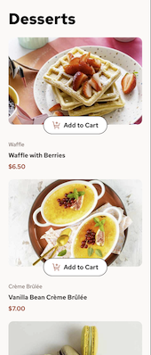
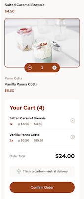
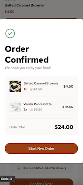
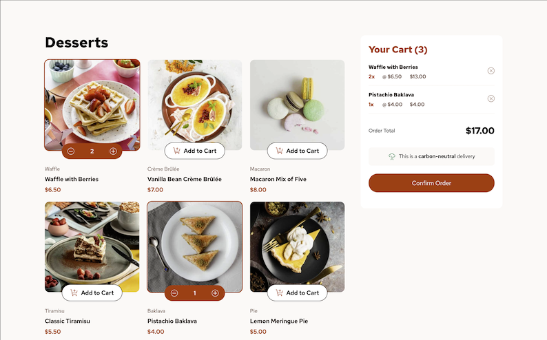
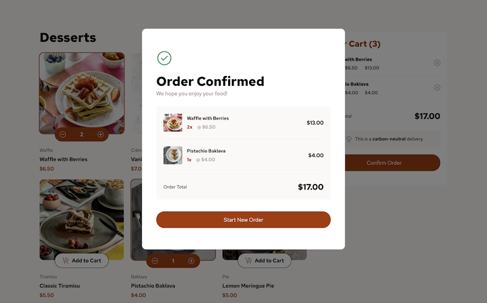

# Frontend Mentor - Product list with cart solution

This is a solution to the [Product list with cart challenge on Frontend Mentor](https://www.frontendmentor.io/challenges/product-list-with-cart-5MmqLVAp_d). Frontend Mentor challenges help you improve your coding skills by building realistic projects.

## Table of contents

- [Overview](#overview)
  - [The challenge](#the-challenge)
  - [Screenshot](#screenshot)
  - [Links](#links)
- [My process](#my-process)
  - [Built with](#built-with)
  - [What I learned](#what-i-learned)
  - [Continued development](#continued-development)
- [Author](#author)

## Overview

This app is built with React in the frontend. A backend part has been added using MongoDB, Express & Node.js.

### The challenge

Users should be able to:

- Add items to the cart and remove them
- Increase/decrease the number of items in the cart
- See an order confirmation modal when they click "Confirm Order"
- Reset their selections when they click "Start New Order"
- View the optimal layout for the interface depending on their device's screen size
- See hover and focus states for all interactive elements on the page

### Screenshots

 &nbsp;&nbsp;
 &nbsp;&nbsp;

### Links

- Solution URL: [GitHub - Products-list-with-cart](https://github.com/MCDoodle1/Product-list-with-cart)
- Live Site Frontend: [GitHub Pages](https://mcdoodle1.github.io/Product-list-with-cart/)

## My process

First I designed the frontend of the app using HTML, CSS and React (Vite). After this I added the backend component using MongoDB, Express and Node.js. By using the JSON-file as backup, the frontend will also work without database connection.

### Built with

- CSS custom properties
- Flexbox
- CSS Grid
- Mobile-first workflow
- [React](https://reactjs.org/) - JS library
- [Vite](https://vite.dev) - Frontend build tool
- [MongoDB](https://www.mongodb.com) - MongoDB Database
- [Express](https://expressjs.com) - Express web framework for Node.js
- [Node.js](https://nodejs.org/en) - Cross-platform JavaScript runtime environment

### What I learned

I practiced my knowledge of CSS and used by knowledge of MERN to add a backend functionality to a Frontend Mentor challenge.

I learned a lot about rendering data from a database and from a JSON file as backup. Especially rendering of images was difficult for me, but I succeeded in the end.

### Continued development

Extend my knowledge of fullstack applications.

## Author

- Website - [Marco Clarijs](https://github.com/MCDoodle1)
- Frontend Mentor - [@MCDoodle1](https://www.frontendmentor.io/profile/MCDoodle1)
